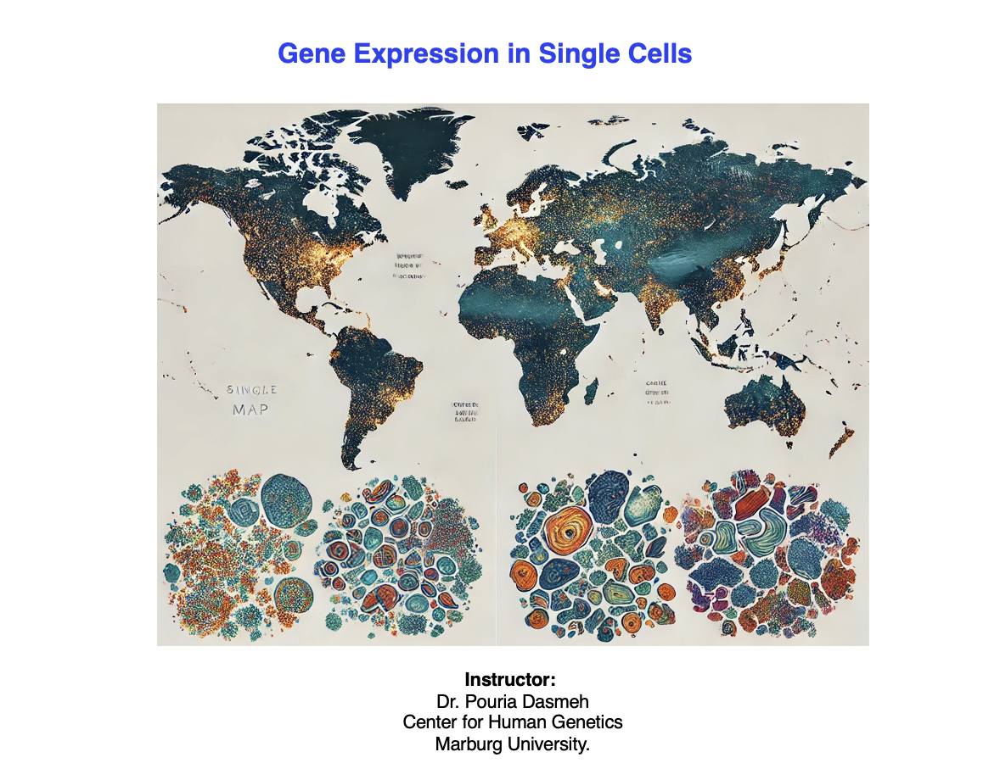

## "Identification of Disease Relevant Cell Types?"

In this course we will review the fundamental concepts and application of single-cell transcriptomics in genetic research,

<h3>Seurat Tutorial</h3>

